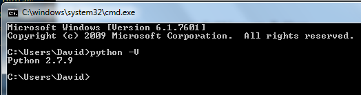

This documentation will provide a brief outline of the steps necessary to install Python on a Windows computer. In addition, it describes how to set up pip, Python's package manager.

## Setting up Python
Download Python from this [link](https://www.python.org/downloads/). Here, you can download the latest version of Python 2 or 3. If there is another version you want, scroll down and download the desired release.

Navigate to your Downloads directory and double click the MSI Python file that was just downloaded.

If a Security Warning window pops up, click **Run**, then navigate through the installer (Check *Install for all users* then click **Next >**. You can choose the directory to install python. The default directory (e.g. C:\Python27 for Python 2) is fine. Click **Next >**).

Once completed, you need to add Python to your **PATH** variable so that you can access Python from the command prompt.

#### Adding Python to PATH Variable

To add Python to your PATH, go to **Start** > **Control Panel** > **System and Security** > **System** > **Advanced System Settings**. Alternatively, you can run `sysdm.cpl` in the command prompt.

Regardles go to the **Advanced** tab in the popup window, then click **Environment Variables**.

You should see a new popup window. In the section **System variables**, select **Path** and click **Edit**. A new window will appear.

In the text box **Variable value** is a semicolon separated list of directory paths. At the start of the text box, add the path to the Python directory (e.g. C:\Python27). Be sure to end the path with a semicolon to separate it from the other list items. 

In addition, we are going to add the path where pip is/will be. Add the path **`<Path to Python directory>\Scripts`** to the PATH variable also. Confirm your changes by clicking **OK**. 

To verify Python was successfully installed, open the command prompt (**Start** > type `cmd` in "Search programs and files" and open the application "cmd.exe") and enter:

    python -V

You should see the currently installed Python version.

If instead you get a message saying `python` is not a recognized command, double check that the Python directory is in your PATH Environment variable.

### Getting Pip
Pip should come prepackaged in Python 2.7.9 and later (for python 2) or Python 3.4 and later (for python 3). To check if pip is installed already (and in your PATH variable), run the following in the command line:

        pip -V

This should print the current version of pip installed. 

If `pip` is not a recognized command and `<Python Directory Path>\Scripts` is in your PATH, then you can install pip by following the steps [here](https://pip.pypa.io/en/latest/installing.html).