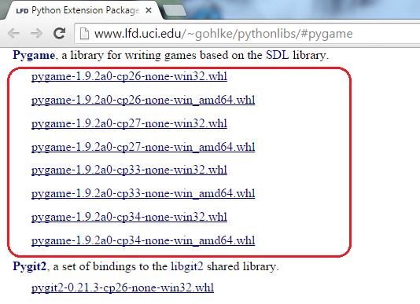
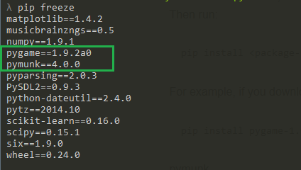

# Set up Pymunk for Windows
This documentation willl outline the steps to properly install and run the Pymunk physics library using Pygame as a renderer. 

## Requirements
+ Python (>=2.7)
+ Windows 7
+ Pip (python's package manager)

## Installing Pymunk
In the command prompt run 

    > pip install pymunk

This will download and install the latest version of pymunk. To check if pymunk was properly installed, open Python's command line interpreter (type <code>python</code> on the command line) and run 

    >>> import pymunk

If you see
        
    Traceback (most recent call last):
        File "<stdin>", line 1, in <module>
    Import Error: No module named pymunk

then the package was not properly installed.

### Compiling Chipmunk in Release Mode
The Chipmunk code that comes with the pymunk library is compiled in debug mode. Therefore, whenever you run pymunk code, there are several debug pring statements that occur from the Chipmunk code. The only way to remove these print statements is to compile Chipmunk in release mode. Luckily, the [pymunk website](http://pymunk.readthedocs.org/en/latest/installation.html#compile-chipmunk) outlines how to do this. However, for completeness, I will go through the steps to do this for Windows here.

Download and install the TDM-GCC package [here](http://tdm-gcc.tdragon.net/). This package comes with a GCC compiler for Windows which we'll need to compile the Chipmunk C code. Theoretically, any GCC compiler should work; however I have only had success with TDM-GCC. To check that the compiler is successfully installed, type `gcc -v` in a terminal.

If you installed the compiler successfully you should see the version of gcc installed. If the terminal prints a message stating that `gcc` is not a recognized command, the TDM-GCC directory may not be in you Path variable. By default TDM-GCC is added to Window's Path variable; however, be sure to double check that it is indeed there. More specifically, you want `<Path to TDM-GCC>\TDM-GCC-32` to be in the Path variable, where `TDM-GCC-32` is replaced by whatever the TDM-GCC directory name is.

Once the compiler is installed, download the pymunk repository from its github
page [here](https://github.com/viblo/pymunk).

In the repository directory on your local machine, run the following command in the terminal:

        > python setup.py build_chipmunk --compiler=mingw32 --release

After the compilation is complete, replace all the files in `<Path to Python>\Python27\Lib\site-packages\pymunk` with the corresponding files in the `pymunk` directory in the repository you manually downloaded.

## Installing Pygame
Unfortunately, installing pygame on Windows is not as easy as pymunk (only slightly harder). For some reason, pip does not seem to find the pygame package. Here is a work around that seems to work. 

#### Install Wheels

We are going to install pygame as a wheel file. As stated [here](https://pypi.python.org/pypi/wheel), "A wheel is a ZIP-format archive with a specially formatted filename and the .whl extension". Therefore we need to install the wheel Python package.

Install the wheels package using pip:

    pip install wheel

#### Getting Pygame
Finally, we can install pygame. Go to this [link](http://www.lfd.uci.edu/~gohlke/pythonlibs/#pygame) and you should see several Pygame files.

Download the <code>*win32.whl</code> file that has the proper Python version. For example, if you have Python 2.7, download <code>pygame-1.9.2a0-cp27-none-win32.whl</code>.

On the command line, <code>cd</code> into the directory containing the .whl file you downloaded above. Then run:

    pip install <package-name>.whl

For example, if you downloaded <code>pygame-1.9.2a0-cp27-none-win32.whl</code> then run:

    pip install pygame-1.9.2a0-cp27-none-win32.whl

### Check
To check that you have all the proper packages you can run: <code>pip freeze</code>. If you correctly installed the packages, you should see:

Of course, the version of each package may be different on your computer.

In addition, you can go to the Python command line interpreter and type <code>import pymunk</code> and <code>import pygame</code>. If you see no errors, then the packages are correctly installed.
